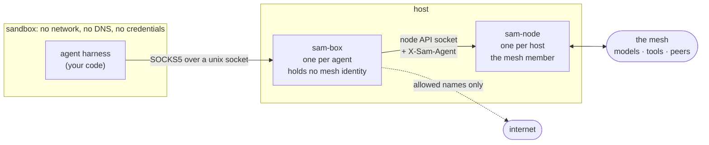
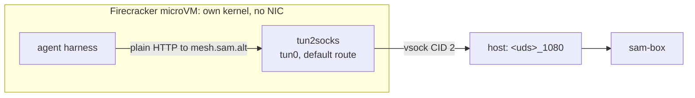

## What you actually deploy

An agent is usually three things bolted together: some logic that decides what
to do next, a model that does the thinking, and a set of tools it can act
with. Deploying one normally means deploying all three, plus the credentials
for the model, plus network access broad enough for the tools to work — which
in practice means the agent can reach the whole internet, because nobody knows
in advance which addresses it will need.

On SAM you deploy **only the first one**. The mesh provides the other two, and
the network the agent gets is exactly the network its policy describes.

The piece you write and ship is the **harness**: the loop that holds the
conversation, decides when to call a tool, and knows when the work is done.
Everything else is asked for by name at runtime.

| | Who provides it | How the agent asks |
| --- | --- | --- |
| **Harness** | You. This is your code. | — |
| **Inference** | The mesh, from whichever peer policy allows | `http://mesh.sam.alt/v1` |
| **Tools (MCP)** | The mesh, local and remote peers alike | `http://mesh.sam.alt/mcp` |
| **Network** | The boundary, per flow, by name | ordinary HTTP to allowed names |

The consequence worth pausing on: **the harness holds no credentials**. There
is no model API key in the sandbox, no mesh token, no service account file.
This is not a convenience. An agent that holds a key can leak a key, and an
agent that can be prompt-injected into leaking one will eventually be.

## The three concepts

### Inference is a name, not an endpoint

The agent asks `mesh.sam.alt` for a model. It does not know which peer answers,
and it cannot find out. Policy decides which providers this agent may use, and
the mesh picks among them.

```python
client = AsyncOpenAI(base_url="http://mesh.sam.alt/v1", api_key="unused")
```

That is an ordinary OpenAI SDK client. Nothing about it is SAM-specific, which
matters: if running on the mesh required a bespoke client, every existing agent
would have to be rewritten to move onto it.

The `api_key` is a placeholder because the SDK insists on one. The real
authentication happens outside the sandbox, where the agent cannot reach it.

### Tools arrive over MCP, and the list is per-agent

The same name serves tools:

```python
async with sse_client("http://mesh.sam.alt/mcp") as (read, write):
    async with ClientSession(read, write) as session:
        await session.initialize()
        tools = await session.list_tools()
```

Two agents on the same node can list different tools, because the mesh answers
according to who is asking. Tools hosted by other peers appear alongside local
ones and are called identically — the agent cannot tell, and does not need to.

A refused tool call comes back as an error the model can read, not a crash. A
denial is information the agent should reason about, not an outage.

### The boundary is the only way out

The sandbox has no network interface, no DNS resolver and no route. It has a
single Unix socket, on which `sam-box` speaks SOCKS5.

Every connection the agent opens arrives there as a **name**, and the boundary
decides what it is:

- `mesh.sam.alt` — the mesh's own surface: inference and tools.
- `<service>.mcp.sam.alt` — a specific mesh service, provider chosen by discovery.
- anything else — matched against the agent's egress allowance, and refused if absent.

Because the destination arrives as a name rather than an address, policy can be
written about `api.github.com` rather than about whatever IP that resolves to
this week. And because the sandbox has no other route, a refusal is not a
speed bump the agent can route around — there is nothing to route around it
with.

### Identity is asserted about the agent, never by it

`sam-box` reads a **bundle** that names the agent and describes what it may
reach. The bundle lives outside the sandbox. The agent never sees it and cannot
change it.

```yaml
version: v1
agent:
  id: researcher-1.prod.acme.example
  external_id: system:serviceaccount:agents:researcher
egress:
  allow:
    - api.github.com
```

Writing that file is not enough to become that agent. `sam-box` verifies a
platform credential — a Kubernetes projected service account token, for example
— and accepts the bundle only if the credential's subject matches
`external_id`. The mesh identity is a claim about a platform identity that
something else already vouched for.

On every request the gateway asserts the agent to the node, overwriting
anything the sandbox tried to set. Mesh policy can then be written about the
agent rather than about the host it happens to run on.

## The architecture



Two separations do the work.

**One `sam-node` per host, one `sam-box` per agent.** The node is the mesh
member: it enrols, holds the mesh identity and maintains peer connections. The
box holds no identity of its own — it consumes the node's API socket on the
agent's behalf and names the agent on every request. Adding an agent therefore
costs a `sam-box`, not a mesh member: [measured at about 18 MB and 59 ms](../../scale-report/),
rather than a new enrolment and a new peer in the DHT.

**The node's API stays on the node's side of the boundary.** An agent never
reaches it. What the agent gets is the curated surface the gateway builds on
top: inference, tools, and permitted egress. The node's own control endpoints —
service registration, peer management — are not part of it.

## Running the example

The example harness is in
[`development/examples/agent-harness`](https://github.com/google/sam/tree/main/development/examples/agent-harness).
It is about a hundred lines and does something real: discovers tools, calls a
model, runs the tool loop, stops when done.

### 1. A node

You need a `sam-node` enrolled in a mesh, serving its API on a socket:

```bash
sam-node run --socket-path /run/sam/node.sock --data-dir /var/lib/sam
```

### 2. A boundary for the agent

```bash
sam-box run \
  --socket /run/sam/agent.sock \
  --sidecar-socket /run/sam/node.sock \
  --bundle ./bundle.yaml \
  --credential-issuer https://kubernetes.default.svc \
  --credential-audience sam
```

Credential verification is on by default. For a local experiment where there is
no issuer to verify against, `--insecure-unverified-bundle` turns it off and
says plainly what you are giving up: whoever can write the bundle decides which
agent this sandbox is.

### 3. The sandbox

The agent needs the boundary socket and nothing else. For a container:

```bash
docker run --rm \
  --network none \
  --cap-add NET_ADMIN \
  --device /dev/net/tun \
  -v /run/sam/agent.sock:/run/agent.sock \
  agent-harness "Summarise the open issues in our repo"
```

`--network none` is the assertion, not just the arrangement. If any of this
worked because the container could route somewhere, it would be proving nothing.

Notice what is *not* passed: no API key, no mesh token, no endpoint, and **no
proxy variable**. The sandbox builds one `tun0`, makes it the default route and
points `tun2socks` at the boundary. The agent asks for `mesh.sam.alt` like any
other host and its traffic leaves through the tun because there is nowhere else
for it to go.

That distinction is worth dwelling on, because the obvious alternative is to set
`HTTP_PROXY` and be done. SAM used to do exactly that, and it was the wrong
layering: an agent that has to *cooperate* with its own confinement is not
confined. The next library that ignores the convention, the next subprocess that
clears its environment, the next protocol that is not HTTP — each one is outside
the boundary. Routing does not have that failure mode, because nothing has to
agree to it.

### 4. Watch what it did

```bash
curl -s http://127.0.0.1:9600/metrics | grep sam_box_flows_total
```

Every flow the agent opened, by route class and outcome, including the ones
that were refused. Refusals never appear as latency, so counting them is the
only way to see them.

## In a microVM

A container shares the host kernel. For an agent running code a model wrote, or
code from somewhere you do not control, that may not be a boundary you want to
rely on. Firecracker gives each agent its own kernel for a few tens of
milliseconds of boot time.

The layering is unchanged, and that is the useful part — the microVM swaps out
how the sandbox reaches the socket, not what the agent does:



The guest has no network device at all. `tun2socks` presents a `tun0` that is
the default route and forwards everything to the SOCKS5 boundary over vsock. The
harness makes ordinary HTTP requests to `mesh.sam.alt` and needs no
configuration, because from inside the VM there is nothing else it could be
doing.

Names are resolved by the boundary rather than in the guest, which is why the
sandbox needs no resolver: `tun2socks` runs with virtual DNS, so `mesh.sam.alt`
is handed to the boundary as a name instead of being looked up and failing.

Every address inside the sandbox is link-local (`169.254.0.0/16`), which is
what those addresses are for: RFC 3927 describes a single link with no router,
and a tun to the boundary is exactly that. It also means nothing in the sandbox
can be confused with a real destination — a sandbox numbered out of
`10.0.0.0/8` will eventually be deployed somewhere that already uses it. The
resolver address is a fiction that never receives a packet; virtual DNS answers
inside `tun2socks`.

One detail costs people an afternoon: Firecracker's vsock multiplexes guest
connections onto **`<uds_path>_<port>`** on the host. A guest connecting to CID
2 port 1080 arrives on `/var/run/sam-vm-1.vsock_1080`, so that is the exact path
`sam-box --socket` must serve. The host never speaks AF_VSOCK itself, which is
why the same `sam-box` works for containers and microVMs with no code in it that
knows the difference.

## Why this shape

The tempting alternative is to give the agent a token and a proxy and trust it
to behave. That fails in a specific way: the agent is driven by a model, the
model is driven by text it did not write, and any instruction that can reach
the model can attempt to reach the network. Holding a credential is what makes
that attempt worth making.

Here the agent has nothing to steal and nowhere to go. Its identity is asserted
by something it cannot influence, its model and tools are granted per-agent, and
its network is a list of names checked on every flow. What it may do is a
property of the deployment, not of how well the prompt was written.

## See also

- [Agent architecture](../../agent-architecture/) — the design decisions and why the boundary is SOCKS5
- [What an agent costs](../../scale-report/) — measured memory, startup and enforcement overhead
- [Secure gateway](../secure-gateway/) — the gateway's configuration surface
